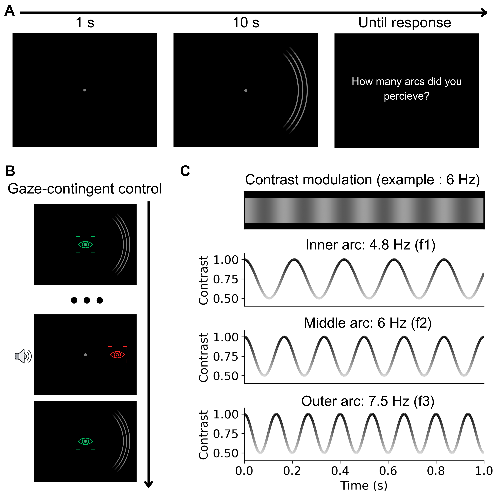
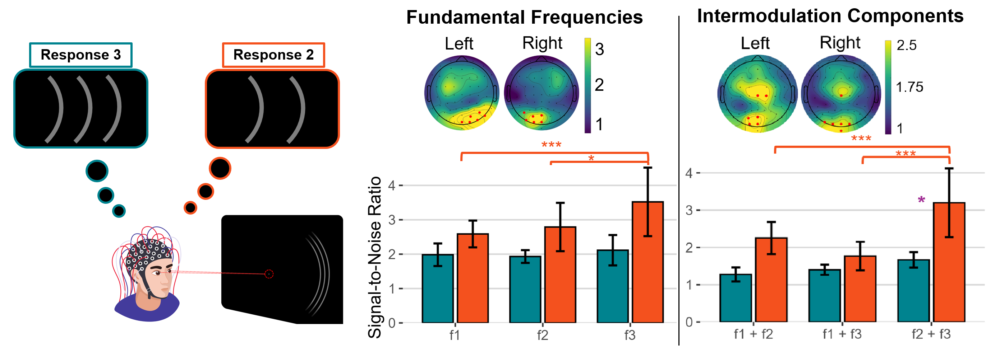
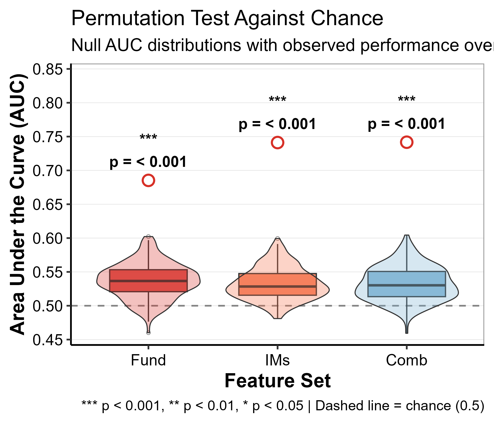
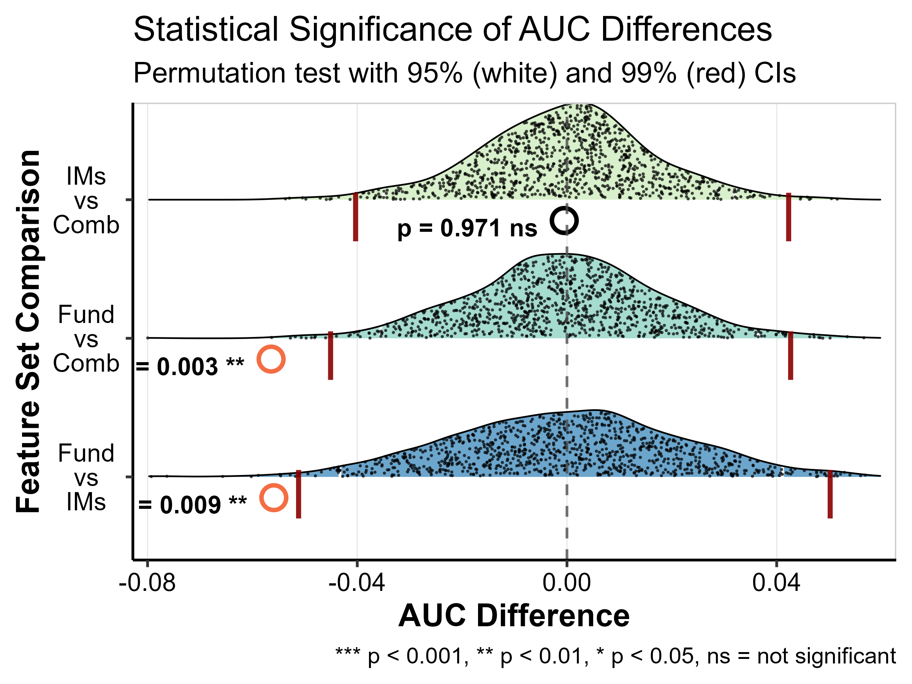

# Integration Rather Than Suppression Drives Information Loss in Peripheral Vision

Oztas, D. N., L-Miao, L., Sayim, B., & Alp, N.

## Overview

When multiple identical objects are presented in the visual periphery, observers often report seeing fewer items than are actually present — a phenomenon known as **redundancy masking**. This study investigates whether this perceptual loss arises from neural **suppression** (reduced processing of individual items) or **integration** (merging of item representations).

We used **SSVEP (Steady-State Visual Evoked Potentials)** to frequency-tag three identical arcs, each flickering at a distinct frequency (f1 = 4.8 Hz, f2 = 6.0 Hz, f3 = 7.5 Hz). This allows us to track the neural representation of each item independently via EEG, while participants report how many arcs they perceive.

**Figure 1.** Experimental paradigm. (A) Trial structure: fixation (1 s), stimulus presentation (10 s), response screen. (B) Gaze-contingent control with eye tracking. (C) Each arc was contrast-modulated at a unique frequency.

## Key Findings

### SSVEP Results

Fundamental frequency SNR was comparable across conditions (Response 2 vs. 3), suggesting individual item representations are **not suppressed** when fewer arcs are perceived. In contrast, intermodulation (IM) frequencies — neural signatures of nonlinear interaction between items — differed between conditions, pointing to **changes in integration**.

**Figure 2.** Left: Experimental conditions (Response 3 = veridical, Response 2 = redundancy masking). Center: Fundamental frequency SNR and ROI topographies -- no significant condition differences. Right: Intermodulation component SNR -- significant condition differences, indicating altered neural integration when fewer items are perceived.

### SVM Classification

Single-trial SVM classifiers trained on SSVEP features decoded the perceived number of arcs (Response 2 vs. 3). All three feature sets (fundamentals, IMs, combined) significantly outperformed chance. IM-based features outperformed fundamental-based features, consistent with integration as the mechanism underlying redundancy masking.

**Figure 3B.** Permutation test against chance. Null AUC distributions (200 permutations) with observed performance overlaid. All feature sets significantly above chance (p < 0.001).

**Figure 3D.** AUC difference distributions (1000 permutations). Fundamentals significantly underperformed both IMs (p = 0.009) and combined (p = 0.003) feature sets. IMs vs. combined was not significant (p = 0.971).

## Quick Start

Intermediate CSV files are included in `data/spectral_csv/`, so the R pipeline can be run without MATLAB. Set your working directory to `rm_ssvep/` and run scripts in order (see below).

## Execution Order

Set your working directory to `rm_ssvep/` before running R scripts. MATLAB scripts require updating the `project_root` and `eeglab_path` variables at the top of each file.

### Stage 1: EEG Preprocessing (MATLAB)
| Script | Description |
|--------|-------------|
| `s01_preprocess_eeg.m` | Bandpass filter, downsample, bad channel rejection, epoching |

### Stage 2: Spectral Analysis (MATLAB)
Run in any order after Stage 1:
| Script | Description | Output |
|--------|-------------|--------|
| `s02_fft_per_trial.m` | FFT amplitudes per trial | `FFT_Results_regular_wide_RawFFT.csv` |
| `s03_snr_per_condition.m` | SNR per condition (Resp 2 vs 3) | `pCond_SNR_data_regular.csv` |
| `s04_snr_spectrum.m` | SNR spectrum (all frequencies) | `all_SNR_data_regular.csv` |

### Stage 3: Topographic Plots (MATLAB)
| Script | Description |
|--------|-------------|
| `s06_snr_topoplots.m` | SNR topographies per frequency (Fig. 2A) |
| `s07_roi_topoplots.m` | ROI channel topographies (Fig. 2B,C) |

### Stage 4: Behavioral Analysis (R)
| Script | Description |
|--------|-------------|
| `s08_behavioral_merge.R` | Merge behavioral data from all participants |
| `s09_deviation_score_ttest.R` | Deviation score computation + one-sample t-test |

### Stage 5: EEG Statistical Analysis (R)
| Script | Depends on | Description |
|--------|------------|-------------|
| `s10_snr_spectrum_plot.R` | s04 output | SNR spectrum + t-tests vs noise (Fig. 2A) |
| `s11_roi_selection.R` | s04 output | ROI channel selection (top 6 per hemisphere) |
| `s12_fundamental_comparison.R` | s11 | LME: fundamental frequencies (Fig. 2D) |
| `s13_intermodulation_comparison.R` | s11 | LME: IM frequencies (Fig. 2E) |
| `s14_fund_im_combined_plot.R` | s11 | Combined fund + IM comparison figure |
| `s15_oz_channel_analysis.R` | s03 output | Oz channel 3-panel analysis |

### Stage 6: Classification (R)
| Script | Depends on | Description |
|--------|------------|-------------|
| `s16_svm_tuning_testing.R` | s02 output | SVM grid search + training (Fig. 3A) |
| `s17_permutation_vs_chance.R` | s16 | 200 permutations vs chance (Fig. 3B) |
| `s18_permutation_auc_comparison.R` | s16 | 1000 permutations AUC comparison (Fig. 3D) |
| `s19_print_results.R` | s16-s18 | Print formatted results |
| `s20_master_classification_plot.R` | s16-s18 | Combined 4-panel classification figure (Fig. 3) |

Sub-plots sourced by s20:
- `s21_gridsearch_heatmap.R` (Fig. 3A)
- `s22_permutation_boxplot.R` (Fig. 3B)
- `s23_roc_curves.R` (Fig. 3C)
- `s24_auc_diff_ridge.R` (Fig. 3D)

## Data Availability

Intermediate CSV files are included in `data/spectral_csv/` to allow running the R pipeline without MATLAB. Raw EEG data can be obtained from **[OSF](https://osf.io/q9b2f/?view_only=bef14d3ba40a4d7a85ee2584efe867dd)**.

## Citation

If you use this code, please cite:

> Oztas, D. N., L-Miao, L., Sayim, B., & Alp, N. (2025). Redundancy masking and the compression of information in the brain. *bioRxiv*, 2025-05. https://doi.org/10.1101/2025.05.30.657088

## License

This project is licensed under the MIT License. See `LICENSE` for details.
